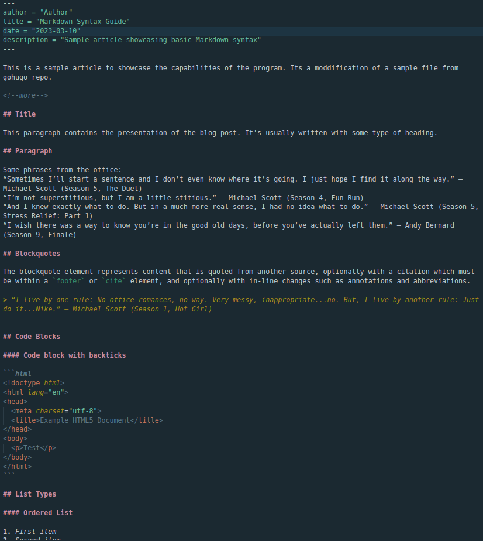
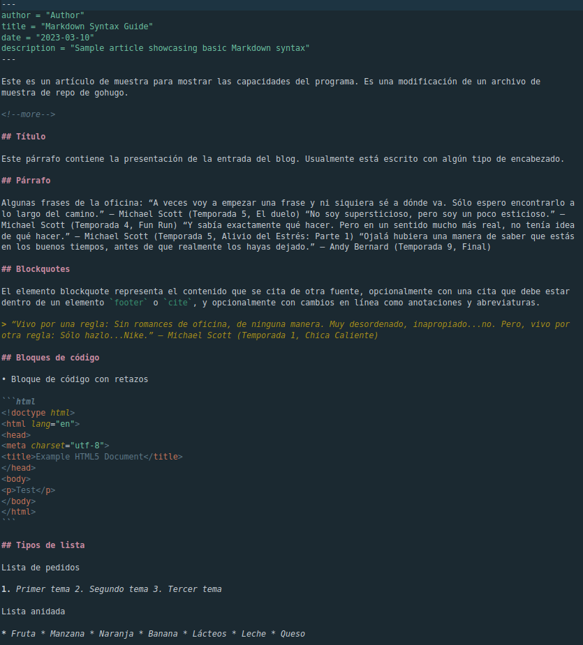

# Overview

This section shows a guided example using the CLI and the python API.

First of all, make sure that the [spanglish](https://github.com/plaguss/spanglish) service is up and running (take a look to the guide if you haven't done it yet). Using docker compose, un a separate window run `docker compose up`.

## CLI

For convenience, a command line app can be installed, with the functionality just to translate a markdown file for the moment (check the README file for the installation instructions):


## Python API


### Instantiate the client

Lets start by importing the code 

```Python
from translate_md.client import SpanglishClient
client = SpanglishClient()
print(client)
SpanglishClient(http://localhost:8000/) 
```

By default it assumes the server is running on *http://localhost:8000/*.

### Translate a piece of text

```Python
michael_scott = """Sometimes I'll start a sentence and I don't even know where it's going. I just hope I find it along the way."""
print(client.translate(michael_scott))
```

which would yield:

```Python
A veces voy a empezar una frase y ni siquiera sé a dónde va.
```

### Translate a batch of texts

```Python
dwitght_schrute = """Whenever I'm about to do something, I think, 'Would an idiot do that?' and if they would, I do not do that thing."""
michael_scott = """I knew exactly what to do, but in a much more real sense I had no idea what to do."""
andy_bernard = "Sorry I annoyed you with my friendship"
jim_halpert = "Bears, beets, Battlestar Galactica."
creed_bratton = """Oh, you’re paying way too much for worms. Who’s your worm guy?"""
oscar_martinez = """I consider myself a good person, but I'm gonna try to make him cry."""
prison_mike = "The worst thing about prison was the Dementors."
kelly_kapoor = """Who says exactly what they’re thinking? What kind of a game is that?"""
stanley_hudson = """Boy, have you done lost your mind? Cause I’ll help you find it!"""
print(client.translate_batch([
    dwitght_schrute, michael_scott, andy_bernard, jim_halpert,
    creed_bratton, oscar_martinez, prison_mike, kelly_kapoor,
    stanley_hudson
]))
```

Which would yield

```Python
[
    "Siempre que estoy a punto de hacer algo, pienso, '¿Haría eso un idiota?' y si lo hicieran, no lo hago.",
    'Yo sabía exactamente qué hacer, pero en un sentido mucho más real no tenía idea de qué hacer.',
    'Lo siento te molesté con mi amistad',
    'Osos, remolachas, Battlestar Galactica.',
    'Oh, tú’ estás pagando demasiado por gusanos. ¿Quién’ es tu gusano?',
    'Me considero una buena persona, pero voy a tratar de hacerlo llorar.',
    'Lo peor de la prisión fueron los Dementores.',
    '¿Quién dice exactamente lo que ellos’re pensando? ¿Qué tipo de juego es eso?',
    'Muchacho, ¿has perdido la cabeza? Porque yo’ te ayudaré a encontrarlo!'
]
```

### Translate a markdown file

The following example uses a sample file placed in the tests folder of this repo. You can copy the content to a file and change the *filename* variable appropriately to run the example (If new_filename argument is not given if will be automatically generated, in this case changing the name to `post-example.es.md` on the same directory):

```Python
from pathlib import Path
filename = Path.cwd() / "tests/data/post-example.md"
new_filename = Path.home() / "Downloads" / "example_file.es.md"
client.translate_file(filename, new_filename=new_filename)
```

TODO: Write result before and after


### Dealing with the markdown file

In case its needed, one can deal with the markdown file without a problem:

```Python
import translate_md.markdown as md

md_content = md.read_file(filename)
proc = md.MarkdownProcessor(md_content)
```

`md.MarkdownProcessor` is a wrapper of the wonderful [`markdown-it-py`'s](https://markdown-it-py.readthedocs.io/en/latest/using.html) `MarkdownIt` class to deal with the files tokens.

```Python
>>> print(proc)
MarkdownProcessor(54)
```

We can access to the text content which will be translated by calling the `get_pieces` method:

```Python
pieces = proc.get_pieces()
```

This will return the list of paragraphs to be sent to the API:

```Python
>>> print(pieces[:3])
[
    'This is a sample article to showcase the capabilities of the program. Its a moddification of a sample file from gohugo repo.',
    '## Title',
    "This paragraph contains the presentation of the blog post. It's usually written with some type of heading."
]
```

After getting these pieces translated we should update the content of the original file and we are ready to obtain the translated file

```Python
proc.update(pieces)
proc.write_to(new_filename)
```

Thats it!

For the moment, there is no cleaning of the markdown content before being sent to the translator, which can create some errors with the content you are getting back with the formatting. The output file obtained should be treated as a draft.

The following two tables 

<table>
  <tr>
    <th>English version</th>
    <th>Versión en castellano</th>
  </tr>
    <td>
         <figure>
            
            <figcaption>post-example-screenshot</figcaption>
        </figure> 
    </td>
    <td>
         <figure>
            
            <figcaption>post-example-screenshot.es</figcaption>
        </figure> 
    </td>
</table>

*The images may be slow, in case you want to see them they are placed under under the `tests/data` folder.*

<!-- 
Prefer the table with the content side by side


and the corresponding output:

 -->


<!-- EXPLICAR QUE SE VE

Some errors happen  -->

